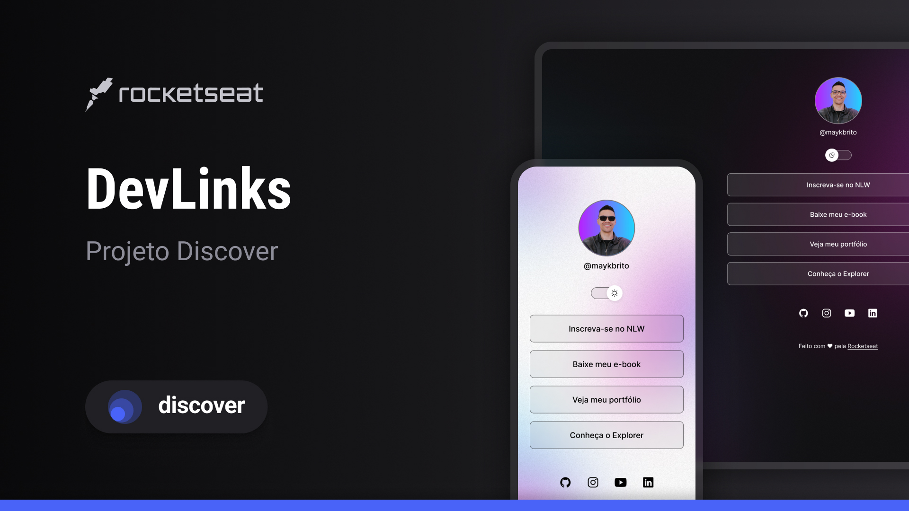

<h1 align="center"> DevLinks </h1>

Programa exclusivo e gratuito, promovido pela Rocketseat para ensino de tecnologias WEB.

  

 

## 🚀 Tecnologias

Esse projeto foi desenvolvido com as seguintes tecnologias:

- HTML e CSS
- JavaScript
- Git e Github
- Figma

## 💻 Projeto

Um simples site para acessar meus dados.

## 🔖 Layout

Você pode visualizar o layout do projeto através [DESSE LINK](Você pode visualizar o layout do projeto através [DESSE LINK](https://www.figma.com/file/IMyqzclkAxASI50ycxFkNJ/DevLinks-%E2%80%A2-Projeto-Discover-(Community)?type=design&node-id=10-620&mode=design&t=vRb9xatKOiWDsYQF-0). É necessário ter conta no [Figma](https://figma.com) para acessá-lo.
). É necessário ter conta no [Figma](https://figma.com) para acessá-lo.

## Licença

Esse projeto está sob a licença MIT.

---

